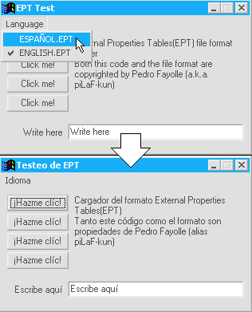



## Language Packs

### Description

The idea of this code is to provide a _good_ language packs engine and format for VB applications.
 
### More Info
 
None. You just select the language.

Switches languages.

             |
---                |---
**Submitted On**   |2001-10-31 17:19:48
**By**             |[N/A](https://github.com/Planet-Source-Code/PSCIndex/blob/master/ByAuthor/empty.md)
**Level**          |Advanced
**User Rating**    |4.7 (14 globes from 3 users)
**Compatibility**  |VB 6\.0
**Category**       |[Miscellaneous](https://github.com/Planet-Source-Code/PSCIndex/blob/master/ByCategory/miscellaneous__1-1.md)
**World**          |[Visual Basic](https://github.com/Planet-Source-Code/PSCIndex/blob/master/ByWorld/visual-basic.md)
**Archive File**   |[Language P3232710312001\.zip](https://github.com/Planet-Source-Code/language-packs__1-28555/archive/master.zip)

